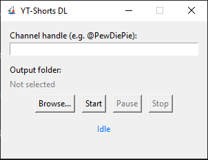
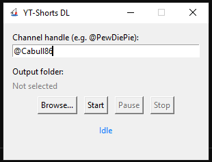
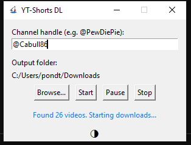
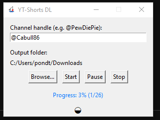
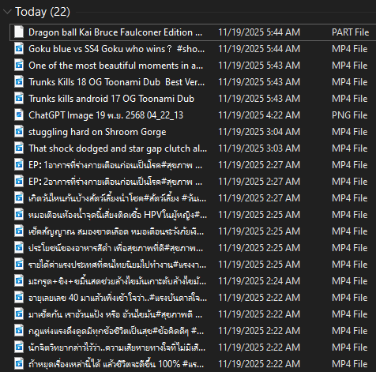

# youtube-shorts-downloader

A tiny desktop tool for bulk-downloading all YouTube Shorts from a channel.

> Built for my own workflow, but you’re welcome to use or fork it.



## Tutorial images
   


## Ingredients
- Python and [pip](https://pypi.org/project/pip/)
    - [yt-dlp](https://github.com/yt-dlp/yt-dlp) - A youtube-dl with additional features  
    - [Tkinter](https://docs.python.org/3/library/tkinter.html) - for building, good-quality for windowapps
    - [PyInstaller](https://pyinstaller.org/en/stable/) - bundles everything into a single windows  executable
- [ffmpeg](https://www.ffmpeg.org/) - merges video + audio into MP4
    

## How to use
1. Paste a channel handle like @PewDiePie
2. Choose an output folder
3. Start the download

## debug & build
```bash
pip install -r requirements.txt
py src/main.py
```
### Building a Windows EXE From the project root

```bash
pyinstaller --noconsole --onefile --icon=icon.ico ^
  --add-binary "ffmpeg.exe;." ^
  --add-binary "yt-dlp.exe;." ^
  src\main.py
```
    
## Project Structure
PROJECT_ROOT
├─ src/
│  ├─ core.py        # paths, yt-dlp wrapper, shared helpers
│  ├─ downloader.py  # download logic (no UI)
│  ├─ ui.py          # Tkinter GUI
│  └─ main.py        # entrypoint
├─ shorts/           # optional: where you keep downloaded videos
├─ yt-dlp.exe
├─ ffmpeg.exe
├─ icon.ico
└─ README.md

## License
MIT License.

